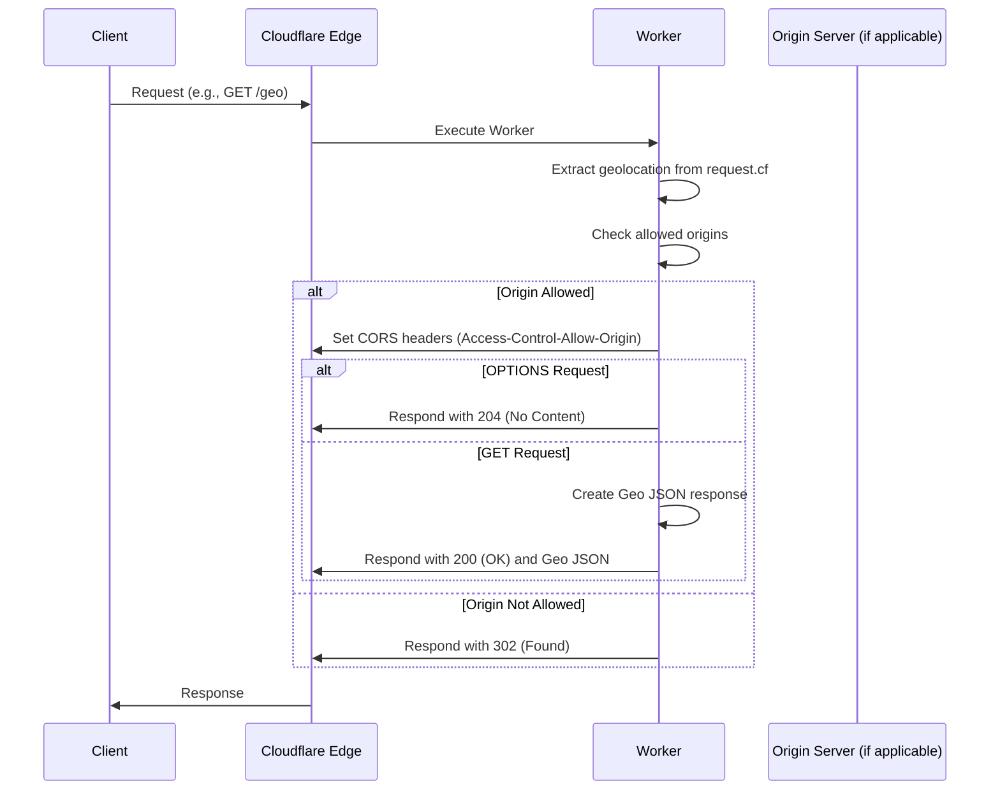

# Cloudflare Worker: Geo Location Information

This repository contains a Cloudflare Worker that returns geolocation information based on the incoming request. It also handles Cross-Origin Resource Sharing (CORS) based on a configured list of allowed origins.

## Overview

The worker intercepts requests, extracts geolocation data from Cloudflare's `request.cf` object, and returns it as a JSON response. It also sets CORS headers to allow requests from specified origins.

## Files

-   `src/index.ts`: The main worker script.
-   `src/utility.ts`: Utility function for domain matching.
-   `wrangler.toml`: Cloudflare Wrangler configuration file.

## Sequence Diagram


## Running Locally

To test your Cloudflare Worker locally before deploying it, you can use Wrangler's local development server.

**Prerequisites:**

-   Node.js and npm (Node Package Manager) installed.
-   Wrangler CLI installed (follow the installation instructions in the "Deployment" section if you haven't already).

**Steps:**

1.  **Navigate to the Project Directory:**
    ```bash
    cd <repository_directory>
    ```
    -   Replace `<repository_directory>` with the path to your cloned repository.

2.  **Start the Local Development Server:**
    ```bash
    wrangler dev --env dev
    ```
    -   This command starts the Wrangler development server using the `dev` environment configuration from your `wrangler.toml` file.
    -   To use `dev-fallback` environment use following command.
    ```bash
    wrangler dev --env dev-fallback
    ```
    -   Wrangler will output the local URL where your worker is running (usually `http://localhost:8787`).

3.  **Test Your Worker:**
    -   Open your web browser or use a tool like `curl` or Postman to send requests to the local URL.
    -   For example, using `curl`:
        ```bash
        curl http://localhost:8787/geo -H "Origin: [https://example.com](https://example.com)"
        ```
        -   Replace `https://example.com` with an allowed origin (or `*` if you've configured it that way).
    -   You can also test `OPTIONS` requests for CORS:
        ```bash
        curl -X OPTIONS http://localhost:8787/geo -H "Origin: [https://example.com](https://example.com)"
        ```

4.  **Make Changes and Reload:**
    -   When you make changes to your worker's code (`src/index.ts` or `src/utility.ts`), Wrangler will automatically reload the worker in the development server.
    -   Just refresh your browser or send another request to see the changes.

5.  **Stop the Development Server:**
    -   Press `Ctrl+C` in your terminal to stop the Wrangler development server.

**Important Notes:**

-   When running locally, Cloudflare's `request.cf` object will contain simulated geolocation data.
-   Make sure your `wrangler.toml` file is configured correctly, especially the `vars` section for the `dev` environment, as these variables will be used during local development.
-   Local testing allows you to quickly iterate and debug your worker before deploying it to Cloudflare's edge network.
## Deployment

1.  **Clone the Repository:**
    ```bash
    git clone <repository_url>
    cd <repository_directory>
    ```
    -   Replace `<repository_url>` with the actual URL of your GitHub repository.
    -   Replace `<repository_directory>` with the name of the directory where you want to clone the repository.

2.  **Install Wrangler:**
    ```bash
    npm install -g wrangler
    ```
    -   This command installs the Cloudflare Wrangler CLI globally, allowing you to interact with Cloudflare Workers.

3.  **Login to Cloudflare:**
    ```bash
    wrangler login
    ```
    -   This command opens a browser window and prompts you to log in to your Cloudflare account.
    -   After successful login, Wrangler will store your authentication credentials.

4.  **Deploy the Worker:**
    -   **Development Environments:**
        ```bash
        wrangler deploy --env dev
        ```
        -   `wrangler deploy --env dev` deploys the worker using the `dev` environment configuration defined in `wrangler.toml`. This deploys to `*.test.dev.xyz/geo`.
    -   **Production Environments:**
        ```bash
        wrangler deploy --env prod
        ```
        -   `wrangler deploy --env prod` deploys the worker using the `prod` environment configuration defined in `wrangler.toml`. This deploys to `test.xyz/geo`.

    **Important Notes:**

    -   Ensure you have Node.js and npm (Node Package Manager) installed before running the `npm install` command.
    -   Make sure your `wrangler.toml` file is correctly configured with your Cloudflare account ID, zone ID, and any necessary environment variables.
    -   The first time you deploy, Wrangler might prompt you to create a new worker. Follow the prompts to complete the process.
    -   After deployment, you can access your worker at the routes specified in your `wrangler.toml` file.